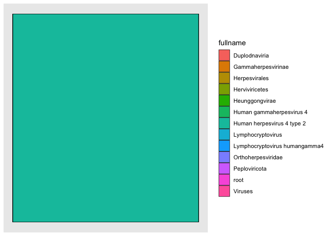
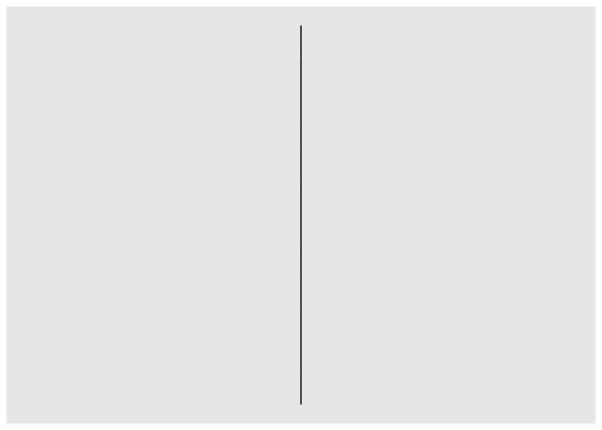

<!-- README.md is generated from README.Rmd. Please edit that file -->

# taxgraph

<!-- badges: start -->

<!-- badges: end -->

taxgraph simplifies exploration of metagenomic classifier results by
parsing them into graph (tree) structures where read support are encoded
as node attributes, making it easy to build sankey, sunburst, and radial
phylogenetic tree visualisations. taxgraph allows visualisations to be
customised by creating subgraphs based on attribute thresholds while
preserving overall lineage relationships (via vertex suppression).

## Installation

You can install the development version of taxgraph from
[GitHub](https://github.com/) with:

``` r
if (!require("remotes"))
    install.packages("remotes")

remotes::install_github("selkamand/taxgraph")
```

## Quick Start

taxgraph visualisations are produced in 3 steps

1)  load a full taxonomy used in into a directed graph structure
2)  parse metagenomic classification reports into data.frames
3)  Convert tabular metagenomics report to a graph structure
4)  visualise as graph

### Step 1: Parse taxonomy

These functions all return an igraph structure with the following
properties

- Directed,
- Up to 1 parent per node, multiple children per node allowed)
- Nodes with no parent allowed (we do not force a single ‘root’ node)
- `name` node attribute represents unique character identifier (usually
  taxid)
- `fullname` node attribute represents scientific name
- `rank` node attribute represents level of taxid in tree
  (e.g. family/genus/species). Exact terms may change depending on
  taxonomy type.

``` r
library(taxgraph)

# From taxDB file (krakenuniq database)
taxonomy = parse_taxonomy(system.file(package = "taxgraph", "taxonomies/taxDB"), type = "taxdb")

# From ktaxonomy (kraken database)
# taxonomy = parse_taxonomy(system.file(package = "taxonomies/ktaxonomy.tsv"), type = "kraken")

# From nodes.dmp and names.dmp (ncbi taxonomy)
# taxonomy = parse_taxonomy(system.file(package = "taxonomies/ncbi.tsv"), type = "ncbi")
```

### Step 2: Parse Metagenomic Classification Reports

These functions output a data.frame with at least the following columns

1.  taxid
2.  reads_covered_by_clade
3.  reads_assigned_directly

``` r
# From krakenuniq report
report_dataframe <- parse_krakenuniq_report(system.file(package = "taxgraph", "reports/krakenuniq.report.tsv"))

# From Kraken2 report
# report_dataframe <- parse_kraken_report(system.filepackage = "taxgraph", "reports/kraken2.report.tsv"))
```

### Step 3: Convert tabular metagenomics report to a graph structure

Use our full taxonomy to turn the tabular report into a graph structure
(where only nodes present in the report are described)

``` r
# Create graph from all taxids in report
report_graph = report_to_graph(report_dataframe, taxonomy)
```

### Step 4: Visualise

The resulting report graph can now visualised using many different
packages, but we provide some functions that make the most common plot
types.

``` r
#plot_igraph_tree(report_graph)
plot_sunburst(report_graph)
plot_sankey(report_graph)
plot_radial_tree(report_graph)
```

### Bonus: Convert to other formats to more easily create your own visualisations

``` r
library(tidygraph)
#> 
#> Attaching package: 'tidygraph'
#> The following object is masked from 'package:stats':
#> 
#>     filter
library(ggraph)
#> Loading required package: ggplot2

# Convert Igraph to tbl_graph for ggraph visualisations
tidy_graph <- as_tbl_graph(report_graph)


ggraph(tidy_graph, 'treemap', weight = reads_assigned_directly) + 
  geom_node_tile(aes(fill = fullname), size = 0.25)
#> Non-leaf weights ignored
#> Warning: Using `size` aesthetic for lines was deprecated in ggplot2 3.4.0.
#> ℹ Please use `linewidth` instead.
#> This warning is displayed once every 8 hours.
#> Call `lifecycle::last_lifecycle_warnings()` to see where this warning was
#> generated.
```



``` r
ggraph(tidy_graph, 'dendrogram') + 
  geom_edge_diagonal()
```



## Similar tools

If you just want an interactive sunburst diagram we highly recommend you
check out [krona](https://github.com/marbl/Krona/wiki). taxgraph was
specifically designed for users who want more control over their plots,
a greater range of visualisations, or prefer programmatically
interacting with their taxonomies.
